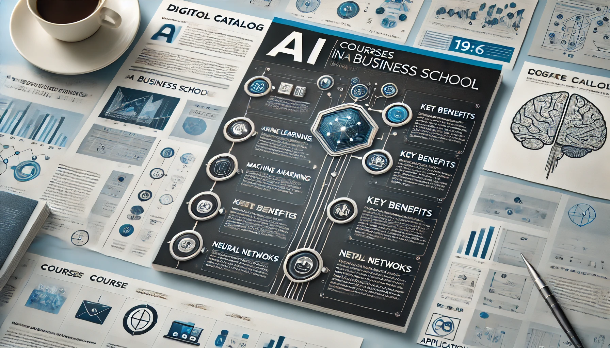

### *---- "Empower organizations through AI, Data Science, and Intelligent Automation."*

### *---- "Inspire artificial intelligence enthusiasts and leaders through education and mentorship."*

Hi! I am **GU Zhan (Sam)**, currently severing senior lecturer role in applied artificial intelligence, division of information technology & operations management, Nanyang Business School, Nanyang Technological University (NTU Singapore).

Where else am I active:

  <a href="https://dr.ntu.edu.sg/cris/rp/rp02466" style="background-color: #1b72c0; color: white; padding: 5px 10px; text-align: center; text-decoration: none; display: inline-block; border-radius: 5px; margin-right: 10px;">NTU</a>

  <a href="https://sg.linkedin.com/in/zhan-gu-27a82823" style="background-color: #1b72c0; color: white; padding: 5px 10px; text-align: center; text-decoration: none; display: inline-block; border-radius: 5px; margin-right: 10px;">LinkedIn</a>

  <a href="https://github.com/dd-consulting" style="background-color: #1b72c0; color: white; padding: 5px 10px; text-align: center; text-decoration: none; display: inline-block; border-radius: 5px; margin-right: 10px;">GitHub</a>

  <a href="https://www.youtube.com/@telescopeuser9284" style="background-color: #1b72c0; color: white; padding: 5px 10px; text-align: center; text-decoration: none; display: inline-block; border-radius: 5px;">YouTube</a>

---

## My Domains of Expertise:

With an intrinsic passion for artificial intelligence, I work with organizations and academic institutions to advance AI technologies and inspire the next generation of leaders. My focus is on leveraging data science, machine learning, intelligent automation and cloud computing to solve problems.

**"Cultivating problem-solving through pedagogy-driven learning, fostering innovation and critical thinking within higher education institutions."** well reflects my teaching philosophy.

Areas where my expertise can be leveraged to provide you values:

  <a href="https://en.wikipedia.org/wiki/Artificial_intelligence" style="background-color: #1b72c0; color: white; padding: 5px 10px; text-align: center; text-decoration: none; display: inline-block; border-radius: 5px; margin-right: 10px;">Artificial Intelligence</a>
  <a href="https://en.wikipedia.org/wiki/Assistive_technology" style="background-color: #1b72c0; color: white; padding: 5px 10px; text-align: center; text-decoration: none; display: inline-block; border-radius: 5px; margin-right: 10px;">Assistive Technology</a>
  <a href="https://en.wikipedia.org/wiki/Banking" style="background-color: #1b72c0; color: white; padding: 5px 10px; text-align: center; text-decoration: none; display: inline-block; border-radius: 5px; margin-right: 10px;">Banking and Financial Services</a>
  <a href="https://en.wikipedia.org/wiki/Data_science" style="background-color: #1b72c0; color: white; padding: 5px 10px; text-align: center; text-decoration: none; display: inline-block; border-radius: 5px; margin-right: 10px;">Data Science</a>
  <a href="https://en.wikipedia.org/wiki/Data_governance" style="background-color: #1b72c0; color: white; padding: 5px 10px; text-align: center; text-decoration: none; display: inline-block; border-radius: 5px; margin-right: 10px;">Data Governance</a>
  <a href="https://en.wikipedia.org/wiki/Deep_learning" style="background-color: #1b72c0; color: white; padding: 5px 10px; text-align: center; text-decoration: none; display: inline-block; border-radius: 5px; margin-right: 10px;">Deep Learning</a>
  <a href="https://en.wikipedia.org/wiki/Edge_computing" style="background-color: #1b72c0; color: white; padding: 5px 10px; text-align: center; text-decoration: none; display: inline-block; border-radius: 5px; margin-right: 10px;">Edge Devices and Systems</a>
  <a href="https://en.wikipedia.org/wiki/Generative_model" style="background-color: #1b72c0; color: white; padding: 5px 10px; text-align: center; text-decoration: none; display: inline-block; border-radius: 5px; margin-right: 10px;">Generative AI</a>
  <a href="https://en.wikipedia.org/wiki/Genetic_algorithm" style="background-color: #1b72c0; color: white; padding: 5px 10px; text-align: center; text-decoration: none; display: inline-block; border-radius: 5px; margin-right: 10px;">Genetic Algorithms</a>
  <a href="https://en.wikipedia.org/wiki/Apache_Hadoop" style="background-color: #1b72c0; color: white; padding: 5px 10px; text-align: center; text-decoration: none; display: inline-block; border-radius: 5px; margin-right: 10px;">Hadoop/Spark Eco-Systems</a>
  <a href="https://en.wikipedia.org/wiki/Intelligent_automation" style="background-color: #1b72c0; color: white; padding: 5px 10px; text-align: center; text-decoration: none; display: inline-block; border-radius: 5px; margin-right: 10px;">Intelligent Process Automation</a>
  <a href="https://en.wikipedia.org/wiki/Large_language_model" style="background-color: #1b72c0; color: white; padding: 5px 10px; text-align: center; text-decoration: none; display: inline-block; border-radius: 5px; margin-right: 10px;">Large Language Models (LLM)</a>
  <a href="https://en.wikipedia.org/wiki/Multimodal_deep_learning" style="background-color: #1b72c0; color: white; padding: 5px 10px; text-align: center; text-decoration: none; display: inline-block; border-radius: 5px; margin-right: 10px;">Large Multi-modal Models (LMM)</a>
  <a href="https://en.wikipedia.org/wiki/Machine_learning" style="background-color: #1b72c0; color: white; padding: 5px 10px; text-align: center; text-decoration: none; display: inline-block; border-radius: 5px; margin-right: 10px;">Machine Learning</a>
  <a href="https://en.wikipedia.org/wiki/Automated_reasoning" style="background-color: #1b72c0; color: white; padding: 5px 10px; text-align: center; text-decoration: none; display: inline-block; border-radius: 5px; margin-right: 10px;">Machine Reasoning</a>
  <a href="https://en.wikipedia.org/wiki/Predictive_modelling" style="background-color: #1b72c0; color: white; padding: 5px 10px; text-align: center; text-decoration: none; display: inline-block; border-radius: 5px; margin-right: 10px;">Predictive Modeling</a>
  <a href="https://en.wikipedia.org/wiki/Statistical_analysis" style="background-color: #1b72c0; color: white; padding: 5px 10px; text-align: center; text-decoration: none; display: inline-block; border-radius: 5px; margin-right: 10px;">Statistical Analysis</a>
  <a href="https://en.wikipedia.org/wiki/Virtual_assistant" style="background-color: #1b72c0; color: white; padding: 5px 10px; text-align: center; text-decoration: none; display: inline-block; border-radius: 5px; margin-right: 10px;">Virtual Agents</a>

---

## Courses and Topics I Teach

> Topics and durations are customizable for your needs.

| Course Names | Synopsis | Tags / Topics | Adjustable Duration (Hours) | Snapshot |
| ------------ | -------- | ------------- | ---------------------------- | ------- |
| AI for Accounting and Finance | This course demonstrates how AI can revolutionize accounting and finance by automating decision-making, data management, and analytics. Participants will learn to leverage cloud computing, decentralized apps, and AI tools like machine learning libraries to solve complex financial challenges, making AI-powered solutions accessible for real business use cases. | Artificial Intelligence, Finance, Data Science, Machine Learning, Cloud Computing, Predictive Analytics, Web3, Generative AI, Decentralized Applications | Lecture: 12 Optional lab: 12 |    |
| AI for Sustainable Innovation (Ideation phase) | This course focuses on how AI and Generative AI can drive sustainability efforts in business and technology. Learners will explore how AI can optimize energy efficiency, reduce waste, and support sustainable agriculture, all while balancing environmental data for decision-making that leads to practical green business practices across industries. | Artificial Intelligence, Generative AI, Sustainability, Climate Monitoring, Green Technology, Energy Efficiency, Resource Conservation, Emissions Reduction | Lecture: 8 Optional lab: 8 |  |
| AI-Driven Logical Reasoning | This course dives into machine reasoning and its applications in automating business decision-making. Learners will explore how AI can replicate human-like reasoning for tasks such as knowledge representation, inference, and decision support. Hands-on exercises will focus on building AI systems capable of handling complex business logic. | Machine Reasoning, AI Automation, Knowledge Representation, Logical Reasoning, Decision-Making Models, Inference, AI Cognitive Functions | Lecture: 12 Optional lab: 12 |  |
| Automatic Speech Recognition | Learn to design automatic speech recognition (ASR) systems using Python. This course introduces key techniques for converting spoken language into text, making ASR solutions feasible for customer service, data entry, and accessibility needs. Participants gain hands-on experience with acoustic modeling, language processing, and API integration to create efficient, real-world ASR applications. | Automatic Speech Recognition, ASR, Python, Language Processing, Speech-to-Text, Text-to-Speech, Acoustic Modeling, APIs, Data Entry | Lecture: 4 Optional lab: 4 |  |
| Deep Learning for Business Success | This course offers hands-on experience with deep learning techniques, focusing on building and optimizing neural networks to solve business challenges. Learners will use tools like TensorFlow and Keras to create models for classification, regression, and image recognition, with the aim of developing deep learning solutions that offer competitive business advantages. | Deep Learning, Neural Networks, Python, TensorFlow, PyTorch, Keras, Image Recognition, Classification, Regression, Model Optimization | Lecture: 12 Optional lab: 12 |  |
| Demystify Artificial Neural Networks, without Coding | This course introduces Artificial Neural Networks (ANNs) using intuitive, non-coding tools to make AI accessible to business professionals. Learners will experiment with ANN structures and hyperparameters using cloud-based and GUI tools to solve pattern recognition and classification challenges, gaining insights without needing to code. Ideal for both business and technical users. | Artificial Neural Networks, Machine Learning, GUI-based Tools, Neural Network Training, Pattern Recognition, Data Classification, Model Performance, Interactive Learning | Lecture: 8 Optional lab: 8 |  |
| Develop and Design Databases for Business Growth | This course empowers participants to design and manage modern databases that align with business needs. From SQL to NoSQL, learners will master the key skills needed to handle business data effectively, including data governance and ethical data handling, ensuring they are prepared to optimize workplace data management systems. | Database Design, SQL, NoSQL, Data Modeling, Relational Databases, Data Governance, Hadoop, MySQL, MongoDB | Lecture: 12 Optional lab: 12 |  |
| Fuzzy Logic & Decision Systems | This course focuses on applying fuzzy logic to make smart decisions in uncertain business environments. Learners will explore fuzzy set theory, membership functions, and inference systems to develop reasoning skills for handling ambiguous data. Ideal for decision-makers aiming to manage risk and uncertainty in business operations. | Fuzzy Logic, Fuzzy Systems, Decision-making, Uncertainty Management, Computational Intelligence, Fuzzy Inference Systems, Optimization | Lecture: 4 Optional lab: 4 |  |
| Generative AI for Business Innovation | This course explores the potential of generative AI to transform industries by automating content creation and enhancing customer engagement. Learners will gain hands-on experience with APIs and AI services to generate text, images, and audio that support real-world business decisions, providing innovative tools for today's competitive market. | Generative AI, Industry Applications, Content Creation, AI Services, Online APIs, Decision Support, AI for Business, Image Generation, Text Generation | Lecture: 4 Optional lab: 4 |  |
| Genetic Algorithms for Business Optimization | Explore how Genetic Algorithms (GA) can solve complex optimization problems in business, from logistics to product design. This course introduces learners to GA concepts like selection, crossover, and mutation, giving them the tools to create efficient solutions using natural evolution principles in various business contexts. | Genetic Algorithms, Optimization, Evolutionary Algorithms, Crossover, Mutation, Business Applications, Heuristic Search, Fitness Functions | Lecture: 4 Optional lab: 4 |  |
| Intelligent Process Automation for Business | This course introduces learners to automating repetitive business tasks through intelligent agents and process automation. Explore how AI, machine learning, and speech recognition can streamline workflows, improving efficiency and reducing operational costs in areas like customer service and sentiment analysis. | Process Automation, AI, Machine Learning, Speech Recognition, Sentiment Analysis, Customer Face Detection, Desktop Automation, Web Automation, Cloud AI APIs | Lecture: 8 Optional lab: 8 |  |
| Knowledge Graphs for Business Insights | Learners in this course will master the creation of knowledge graphs to enhance data relationships for decision-making. Using Neo4j Graph Database, participants will analyze complex data connections and learn to implement knowledge graphs that provide valuable insights for business strategy and AI-driven analytics. | Knowledge Graphs, Data Linkage, Graph Algorithms, Neo4j, Knowledge Representation, AI-Driven Analytics, Data Relationships | Lecture: 4 Optional lab: 4 |  |
| Machine Learning for Business Success | This course teaches practical machine learning techniques for business applications. Learners will explore how to build, evaluate, and deploy models using Python and scikit-learn, with hands-on practice in applying algorithms to solve real-world problems in classification, regression, and clustering, leading to data-driven decisions. | Machine Learning, Python, scikit-learn, Classification, Regression, Clustering, Applied Machine Learning, Model Evaluation | Lecture: 12 Optional lab: 12 |  |
| Natural Language Processing for Business | This course focuses on how businesses can use Natural Language Processing (NLP) to interpret and act on human language data. Learners will explore sentiment analysis, topic modeling, and named entity recognition using Python and tools like spaCy, equipping them with practical skills for analyzing text data in business contexts. | Natural Language Processing, NLP, Python, Sentiment Analysis, Text Analytics, Tokenization, Topic Modeling, Named Entity Recognition, spaCy | Lecture: 8 Optional lab: 8 |  |
| Predictive Modeling using Orange | Learners will develop predictive modeling skills to identify trends and gain insights for strategic decision-making. This course offers practical applications of predictive analytics and machine learning, empowering learners to apply statistical methods to business data for a competitive edge. | Predictive Analytics, Data Science, Statistical Modeling, Forecasting, Anomaly Detection, Business Insights, Orange | Lecture: 12 Optional lab: 12 |  |
| Predictive Modeling using Python | Learners will develop predictive modeling skills to identify trends and gain insights for strategic decision-making. This course offers practical applications of predictive analytics and machine learning, empowering learners to apply statistical methods to business data for a competitive edge. | Predictive Analytics, Data Science, Statistical Modeling, Forecasting, Anomaly Detection, Business Insights, Python | Lecture: 12 Optional lab: 12 |  |
| Predictive Modeling using R | Learners will develop predictive modeling skills to identify trends and gain insights for strategic decision-making. This course offers practical applications of predictive analytics and machine learning, empowering learners to apply statistical methods to business data for a competitive edge. | Predictive Analytics, Data Science, Statistical Modeling, Forecasting, Anomaly Detection, Business Insights, R | Lecture: 12 Optional lab: 12 |  |
| Statistics and Analysis for Business Decisions | Learners will explore statistical analysis techniques for business applications, covering hypothesis testing, regression, and probability. Using R programming, participants will gain hands-on experience interpreting statistical data to inform business decisions, making this course essential for those seeking data-driven insights. | Statistics, R Programming, Probability, Regression, Business Analytics, Hypothesis Testing, Simulation, Confidence Intervals, Data-Driven Decision Making | Lecture: 12 Optional lab: 12 |  |
| Statistics and Analysis for Business Decisions (Bootcamp) | Designed for business professionals, this bootcamp covers statistical analysis using R, focusing on data visualization, predictive analytics, and decision-making. With a mix of lectures and hands-on workshops, learners will analyze data and derive actionable business insights. | Statistics, Data Science, R Programming, Data Visualization, Statistical Analysis | Lecture: 8 Optional lab: 8 |    |

---

## Invited Talks

> Topics and durations are customizable for your needs.

> Showcase any guest lectures, keynotes, or webinars you have delivered.

`Showcase any guest lectures, keynotes, or webinars you have delivered.`

| Talk Title                                                    | Date | Synopsis   | Organization                          | Snapshot                                                                                                                                                                    | Preview                                                                                              |
|---------------------------------------------------------------|------------|------------|---------------------------------------|-----------------------------------------------------------------------------------------------------------------------------------------------------------------------------------|------------------------------------------------------------------------------------------------------|
| Harnessing Chinese AI Technologies [Beijing] | Nov 2024 | This session delves into China's advancements in AI, showcasing innovations in facial recognition, computer vision, and robotics that emulate human cognitive abilities. Discover global opportunities these technologies present, supported by insights from leading AI firms and the 2024 Technology Trends Outlook report. | Nanyang Business School |  |                |
| Harnessing Chinese AI Technologies [Beijing] | Nov 2024 | This session delves into China's advancements in AI, showcasing innovations in facial recognition, computer vision, and robotics that emulate human cognitive abilities. Discover global opportunities these technologies present, supported by insights from leading AI firms and the 2024 Technology Trends Outlook report. | Nanyang Business School |  |                |
| Harnessing Chinese AI Technologies [Beijing] | Nov 2024 | This session delves into China's advancements in AI, showcasing innovations in facial recognition, computer vision, and robotics that emulate human cognitive abilities. Discover global opportunities these technologies present, supported by insights from leading AI firms and the 2024 Technology Trends Outlook report. | Nanyang Business School |  |                |
| Harnessing Chinese AI Technologies [Beijing] | Nov 2024 | This session delves into China's advancements in AI, showcasing innovations in facial recognition, computer vision, and robotics that emulate human cognitive abilities. Discover global opportunities these technologies present, supported by insights from leading AI firms and the 2024 Technology Trends Outlook report. | Nanyang Business School |  |                |
| **Machine Learning for Strategic Business Decisions**         | May-2024   | Singapore  | University of Business & Technology   | Guest lecture covering machine learning principles, data-driven decision-making, and hands-on application for strategic business scenarios.                                      |                          |
| **The Role of Generative AI in Sustainable Development**      | Mar-2024   | Singapore  | GreenTech Summit                      | Presented the impact of AI-driven sustainability efforts, emphasizing innovative uses of AI in climate monitoring, resource optimization, and green technology.                   |                         |
| **Navigating AI and Ethical Data Use in Business**            | Jan-2024   | Singapore  | Business Ethics Webinar Series        | Led an insightful webinar on AI ethics, focusing on responsible data use, transparency, and implications for decision-making in modern business contexts.                        |                                      |
| **Fuzzy Logic and Decision Systems for Ambiguity Management** | Dec-2023   | Singapore  | Institute of Decision Sciences        | Presented the use of fuzzy logic for decision-making in uncertain environments, with practical examples and a focus on computational intelligence.                               |                               |
| **Deep Learning for Image Recognition in Retail**             | Jun-2023   | Singapore  | Retail Analytics Conference           | Keynote focused on deep learning applications in image recognition to enhance customer service, inventory management, and marketing in retail settings.                           |                                |
| **Building Knowledge Graphs for Competitive Intelligence**    | May-2023   | Singapore  | Data Science Innovation Forum         | Delivered a technical session on leveraging knowledge graphs to enhance data linkage and derive strategic insights for competitive advantage.                                    |                      |
| **Harnessing NLP for Customer Engagement**                    | May-2023   | Singapore  | Customer Experience World Conference  | Discussed how natural language processing (NLP) enhances customer insights, personalization, and engagement strategies, with examples of NLP tools and applications.             |                                     |
| **AI-Driven Finance Transformation**                          | Mar-2021   | Singapore  | Global Fintech Forum                  | Delivered a keynote exploring how AI enhances decision-making and automation in finance, covering practical AI solutions and industry case studies.                              |                             |

---

## 4. Research Interests and Aspirations

Research Areas:

- Applied AI for business and financial services.
- AI in health and education (specifically in ASD research).

Current Research Projects: Provide short summaries for ongoing projects, such as:

- AI + ASD Research: Developing AI-based interventions to support individuals with autism.

- Generative AI: Exploring how generative models can be used in finance and healthcare.

- GitHub Repositories: Embed a link to your GitHub repositories (e.g., GitHub Repositories) where you share open-source projects.

---

## 5. Professional Experience
Highlight your previous roles:

Data Scientist at Yokogawa Singapore: Developed data-driven solutions for industrial automation.

- Project Manager at Barclays: Led AI-related projects in the financial sector.
- Software Engineer at Citibank and HDB: Worked on large-scale software engineering projects.
- Focus on the skills and expertise you gained, such as:
- AI for business automation
- Cloud infrastructure deployment
- Data analytics and project management

---

## 6. Invited Talks

Talks: Showcase any guest lectures, keynotes, or webinars you have delivered.

---

## 7. Student Projects Show Cases
Open Source: Highlight significant contributions to GitHub. Feature projects or repositories demonstrating your hands-on expertise in AI and data science. Provide direct links, e.g., GitHub Profile.

Mention any awards or recognitions, such as contributions to AI research or impactful industry projects.

Industry Partnerships: Include collaborations with businesses or institutions (Barclays, Yokogawa, etc.).

## Interested in co-explore commercial or research collaborations? 

Invite organizations, academic institutions, or other professionals to contact you for guest lectures, consulting, or collaborative research:
“Interested in working together? Reach out for collaborations or speaking opportunities in AI, Data Science, and more.”

---

## 10. Infographic Showcase

Profile Overview: A smaller version of your photo and a snapshot of your expertise and domains.

Key Contributions:

3 to 5 core areas, e.g., "AI in Finance, Data Science, AI + ASD Research."
Experience Highlights: Icons and numbers summarizing your experience (e.g., "10+ years in AI," "500+ students taught," "4 industry collaborations").
Projects: Quick stats and icons showcasing your GitHub activity (e.g., "10+ open-source projects," "200+ contributions").

---

## 11. Footer

Social media links (LinkedIn, GitHub, NTU Profile).

Optional: A simple newsletter sign-up or blog link to keep your audience updated on your work.

Infographic Guide:

For the infographic:

Design: Use a professional color scheme aligned with your brand or NTU's colors. Highlight the most important points about your skills and experience.
Icons and Stats: Include visuals like AI symbols, academic caps, or GitHub logos to visually differentiate your key domains (AI, Data Science, etc.).

Flow: Ensure it’s digestible at a glance. Top part includes your name and tagline, followed by your core areas of expertise, and ends with highlights from your professional experience and GitHub contributions.

By implementing these adjustments, your webpage will serve as an effective professional showcase, positioning you well for academic and consulting opportunities.

---

### Reference: TBD
