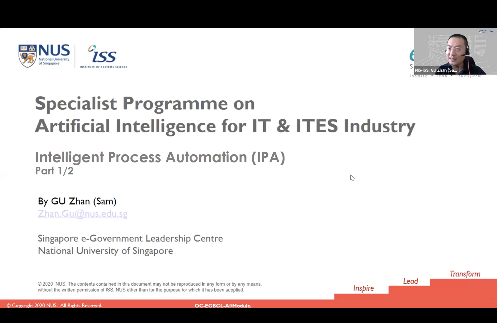
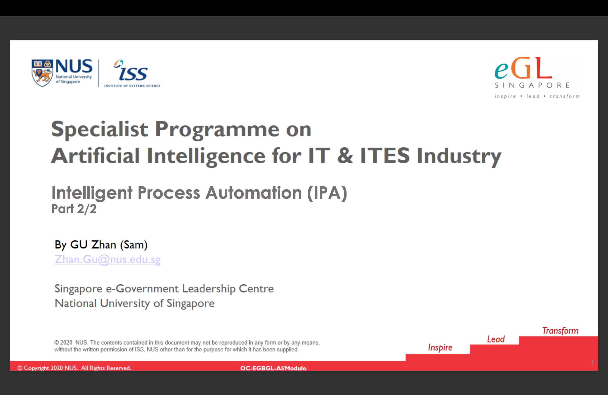
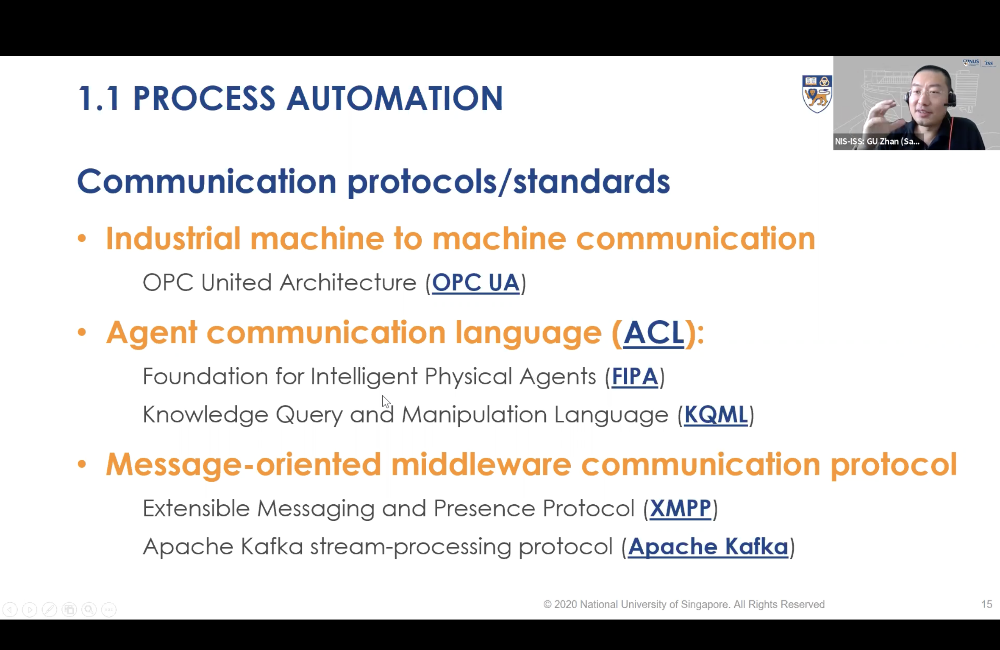

This session showcased AI-powered Intelligent Process Automation (IPA) as a transformative tool for the IT and ITES sectors, driving accelerated growth for Bangladesh’s tech startups. Through hands-on examples and cloud-based AI tools, it emphasized how intelligent agents streamline tasks and boost efficiency across various industrial domains.

---

---

Title:

Artificial Intelligence for IT & ITES Industry, Singapore e-Government Leadership Centre, LICT, Bangladesh Computer Council
