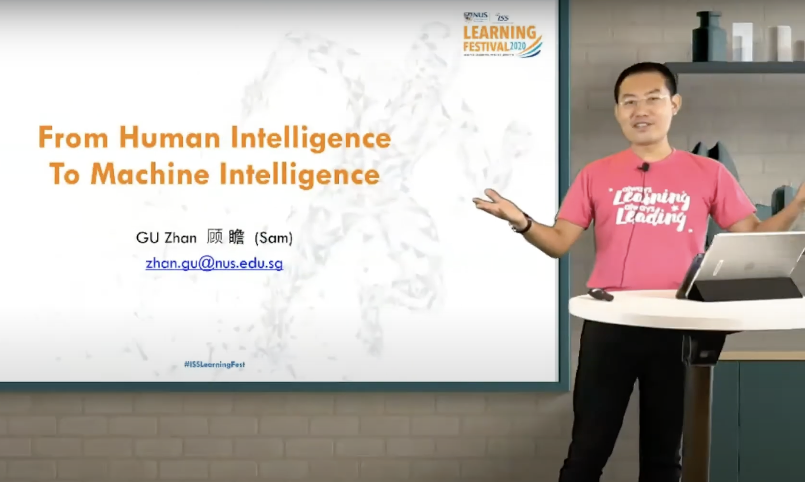
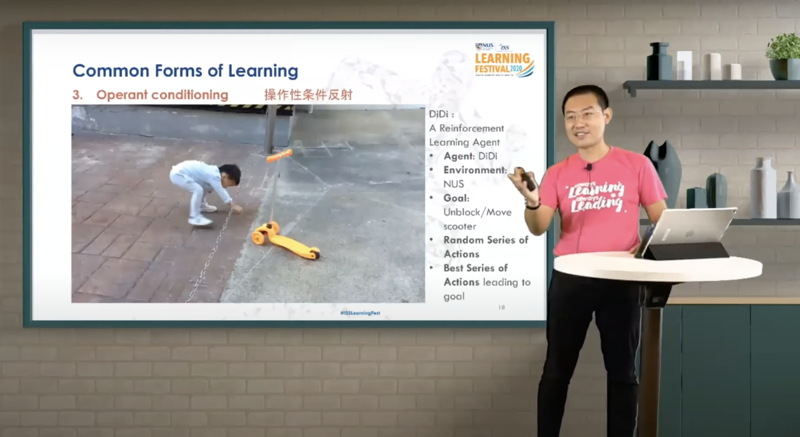
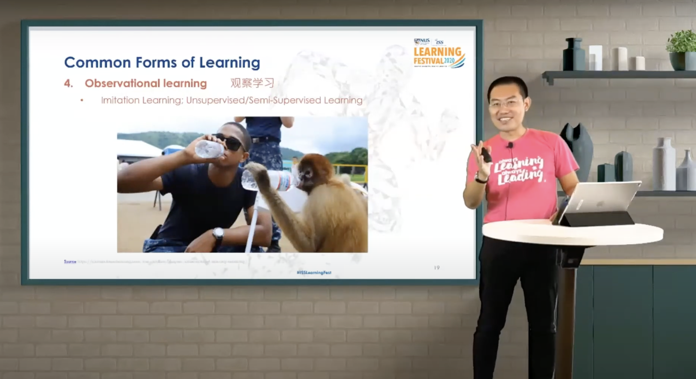

This session debuted at a live, streaming learning festival, tracing the shift from human to machine intelligence through key cognitive processes like perception, learning, and reasoning. Emphasizing resilience and adaptability during the pandemic, it showcased AI's role in driving innovation.

https://youtu.be/HQUxSi52Ujk

---

---

Title:

Live Streaming: From Human Intelligence to Machine Intelligence, Learning Festival, National University of Singapore (NUS)

