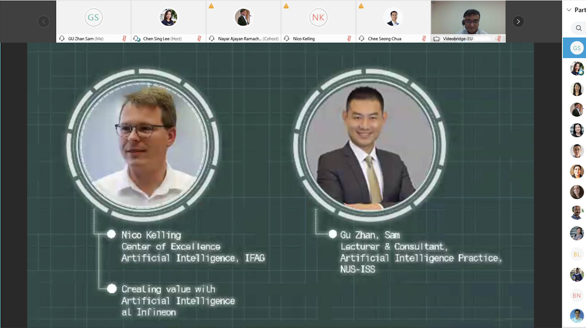
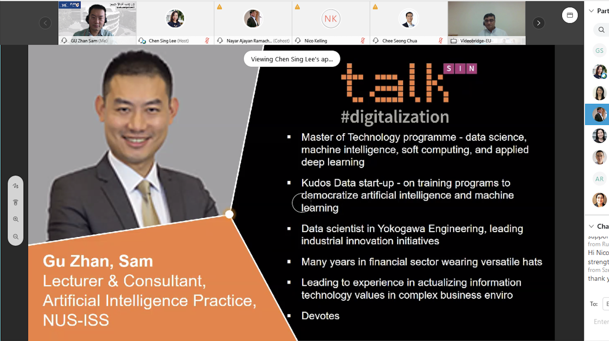

In a talk with 240 Infineon staff, the transition from human to machine intelligence was explored, highlighting Infineon’s AI-driven solutions that enhance energy efficiency, performance, and scalability in sectors like IoT and automotive. Infineon’s responsible AI approach emphasizes global collaboration to drive sustainable innovation across industries.

---

---

Title:
Talk Digitalization Academia and Industry on AI, Infineon Singapore
