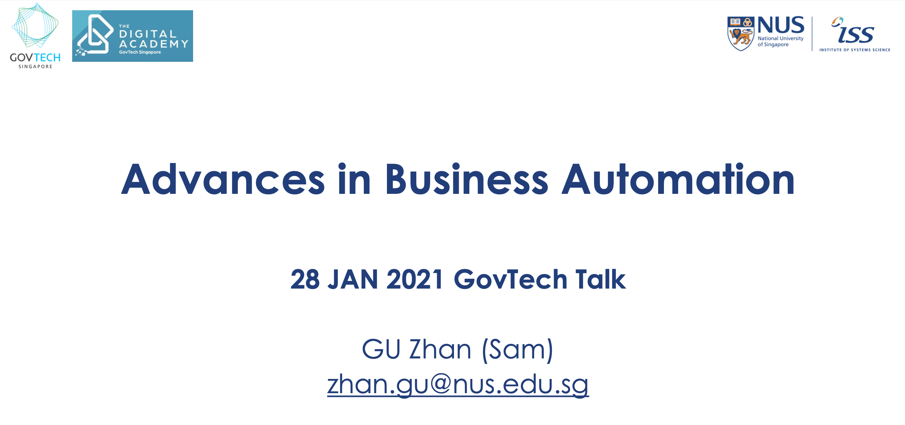
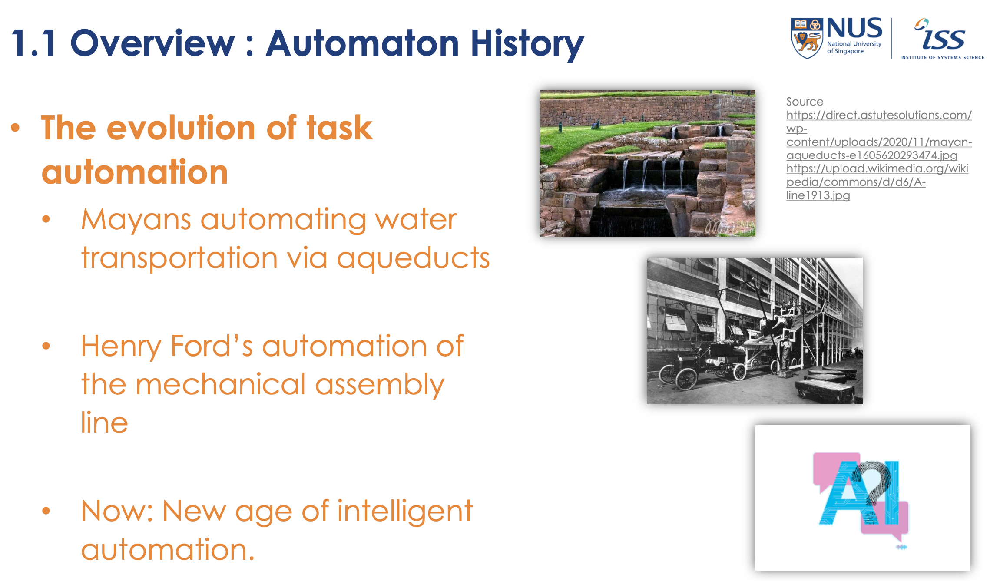

This talk explored the evolution of business automation, comparing hard and soft automation methods and their implications for modern workplaces. It highlighted emerging job roles in automation and offered practical insights for leveraging AI to tackle real-world business challenges.

---

---

Title:

Advances in Business Automation

Agenda:

1.1 Overview

1.2 Hard Automation vs. Soft Automation

1.3 New Jobs in Automation Era

1.4 NUS-ISS Learners’ Intelligent Automation Projects

1.5 How can I apply AI to my business problem?

