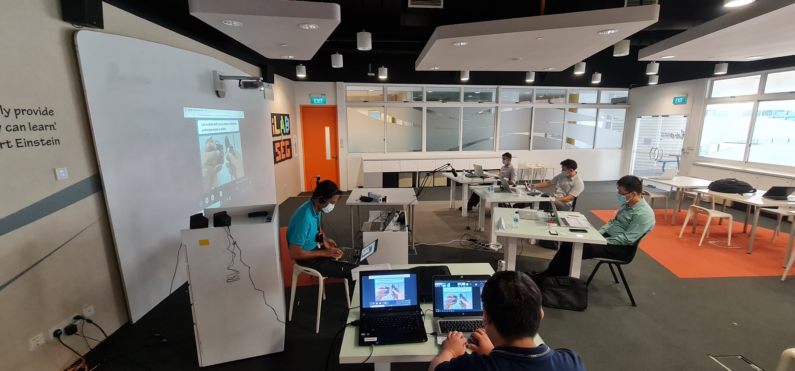
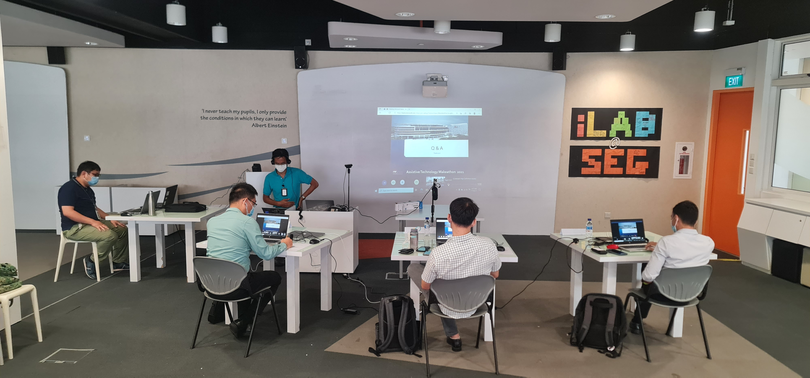

This session showcased inventive assistive technology designs from students across Asia, each aimed at enhancing accessibility for individuals with disabilities. As one of three judges, I evaluated creative solutions focused on breaking down barriers, aligning with the event’s vision of a more inclusive, accessible world through technology.

---

---

Title:

2021 Assistive Technology Makeathon [Judging Panel], Institute of Technical Education
