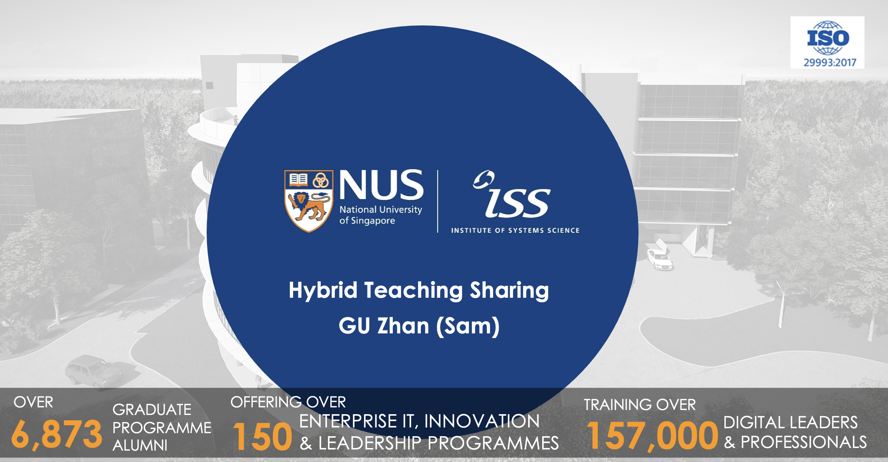

This session shared valuable insights into hybrid teaching practices, showcasing effective strategies to enhance engagement across in-person and remote students. By integrating multiple cameras, microphones, and a dedicated monitor for Zoom interactions, the approach aimed to create an inclusive, interactive learning environment for all participants.

---

---

Title:

Hybrid Teaching Mode across Time Zones, NUS-ISS