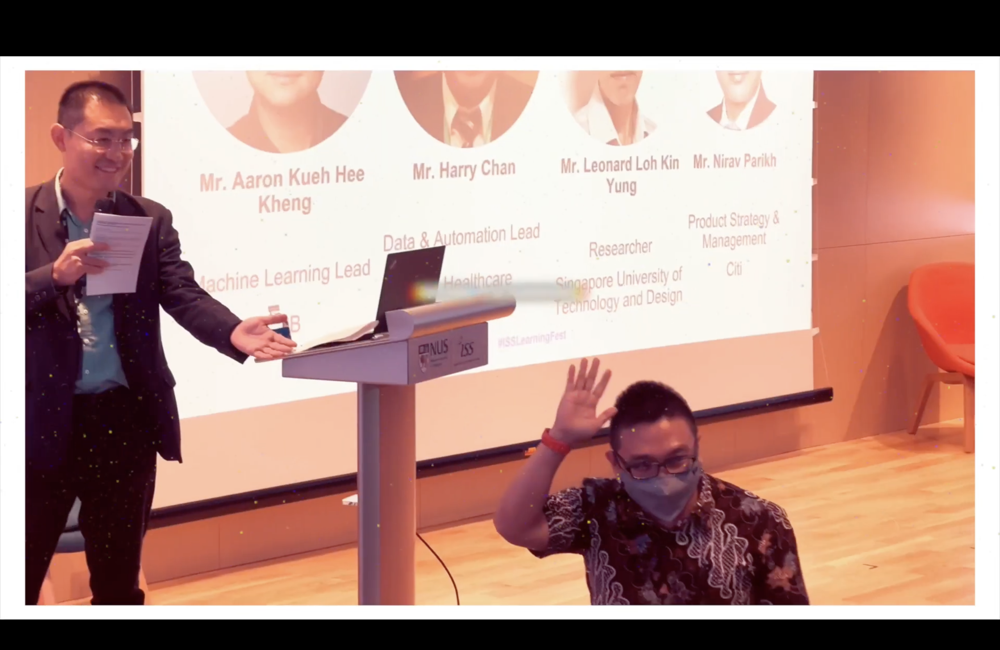
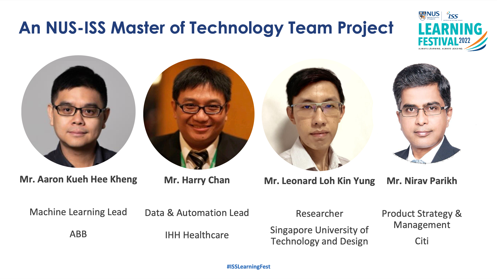
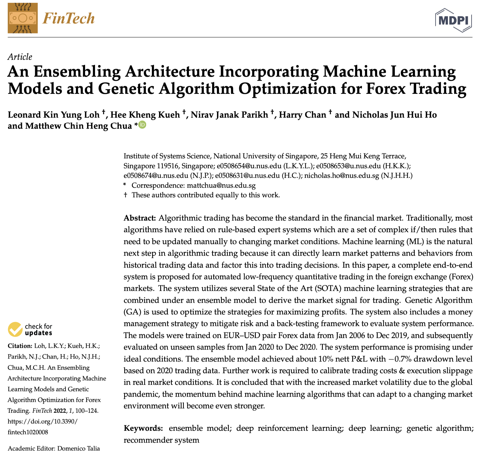
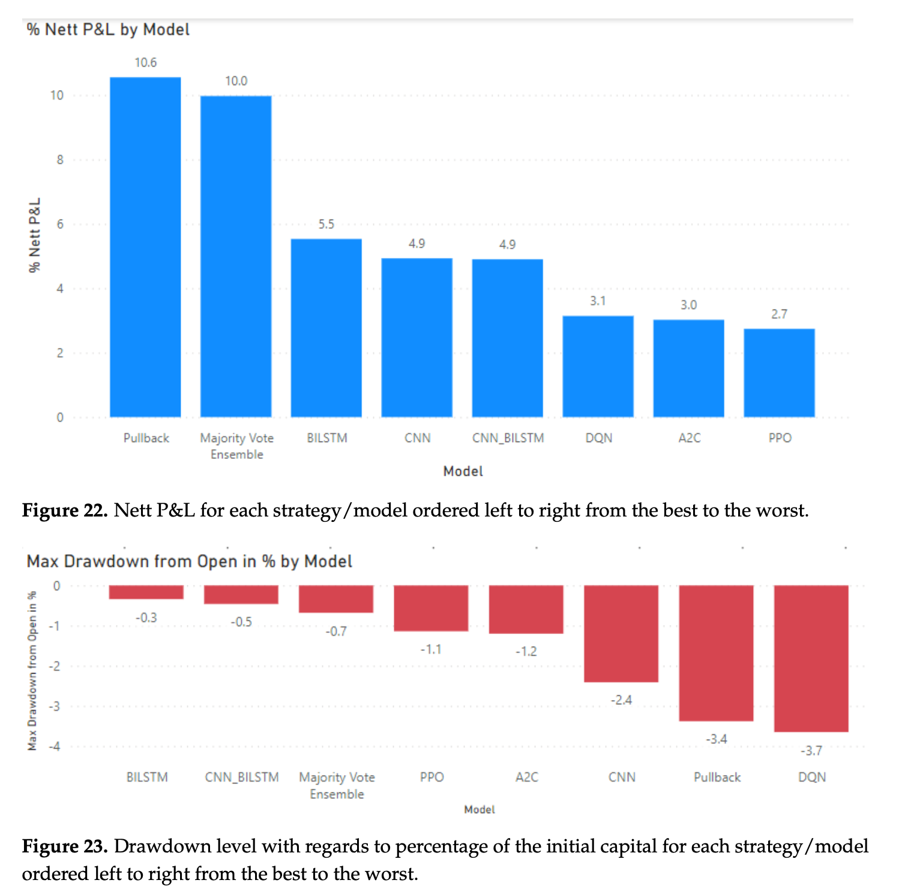

This talk presented an innovative ensembling architecture using machine learning and genetic algorithms to optimize Forex trading, yielding a promising 10% profit under ideal back-testing conditions. The project team, supervised by GU Zhan, highlighted advancements in algorithmic trading and automated financial strategies for enhanced profitability.

https://www.mdpi.com/2674-1032/1/2/8

---

---

Moderator: GU Zhan (Sam) 

Title:

AI in Finance: An Ensembling Architecture Incorporating Machine Learning Models and Genetic Algorithm Optimization for Forex Trading	
