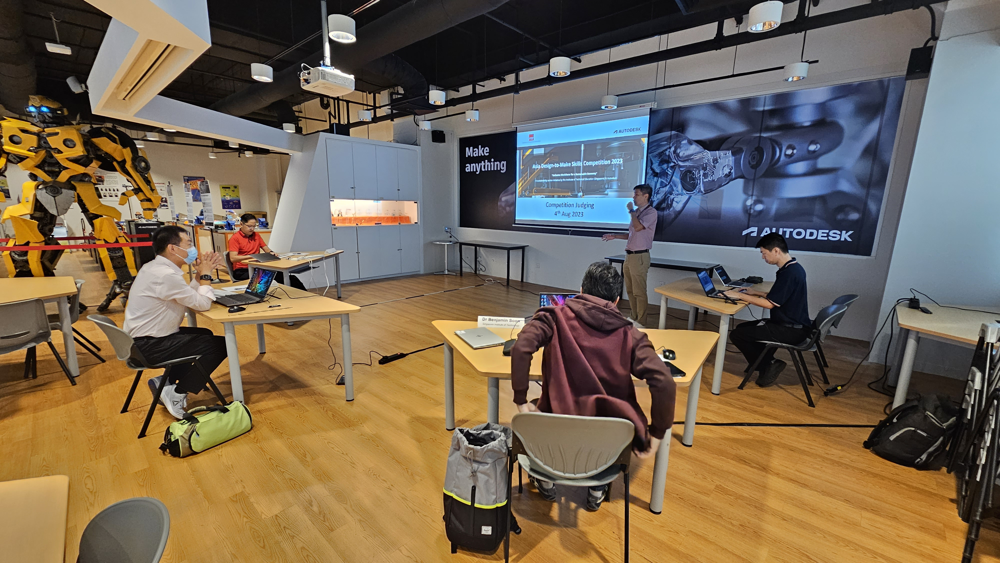
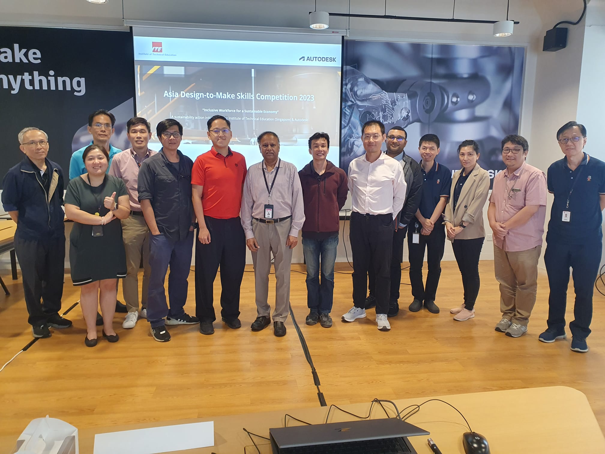

This session celebrated innovation and inclusivity as students from across Asia's vocational institutions showcased their creative solutions for empowering a diverse workforce. As one of three judges, I had the honor of evaluating entries focused on sustainable, accessible workplace solutions, all aligned with the theme, "Inclusive Workforce for a Sustainable Economy."

https://www.thenetworkhub.com/asia-design-to-make-skills-competition-2023/

---

---

Title:

2023 Asia Design-to-Make Skills Competition [Judging Panel], Institute of Technical Education
