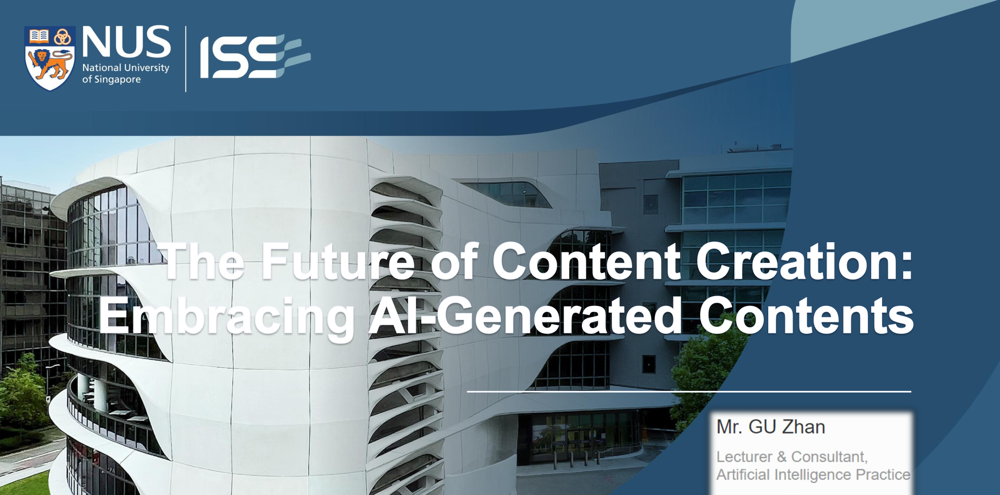
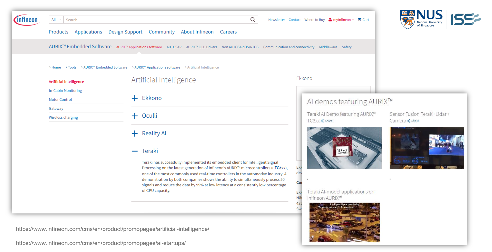

This session explored the transformative impact of AI on content creation within the semiconductor industry, emphasizing its potential to streamline processes and drive innovation in electronics. Attendees discovered how AI-generated content can enhance efficiency, creativity, and personalization, reshaping how technology and advancements are communicated.

---

---

Title:

The Future of Content Creation: Embracing AI-Generated Content
