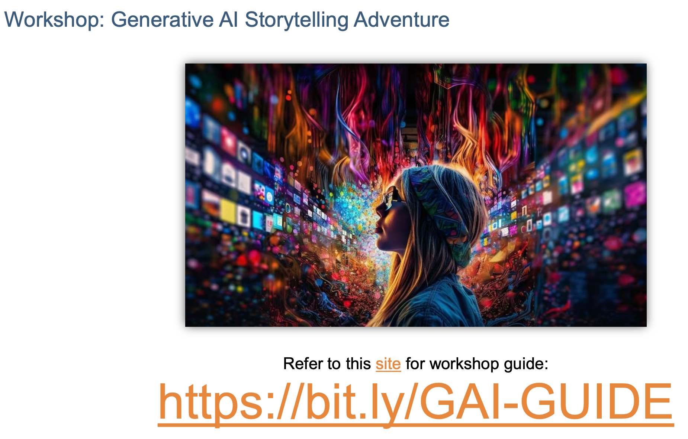

This session introduced students to generative AI, guiding them in creating a storytelling video by leveraging AI tools. Through hands-on collaboration, participants explored AI-generated art, music, and narratives, crafting unique multimedia projects that highlighted creativity and innovation.

https://bit.ly/GAI-GUIDE

---

---

Title:

Unlocking the Creative Potential - Generative AI Workshop

Agenda

1. Evolutionary History of AI, GAI/AIGC

2. Examples and Applications of GAI

3. Workshop: Generative AI Storytelling Adventure

