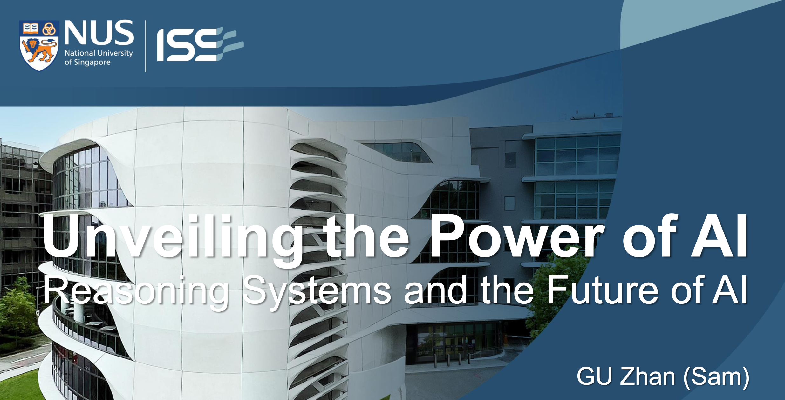
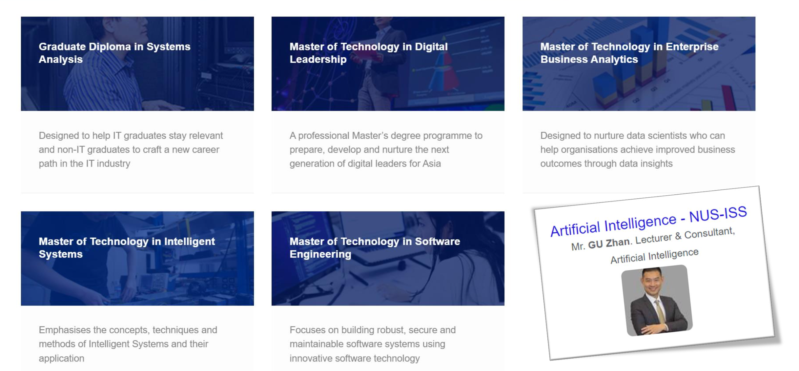
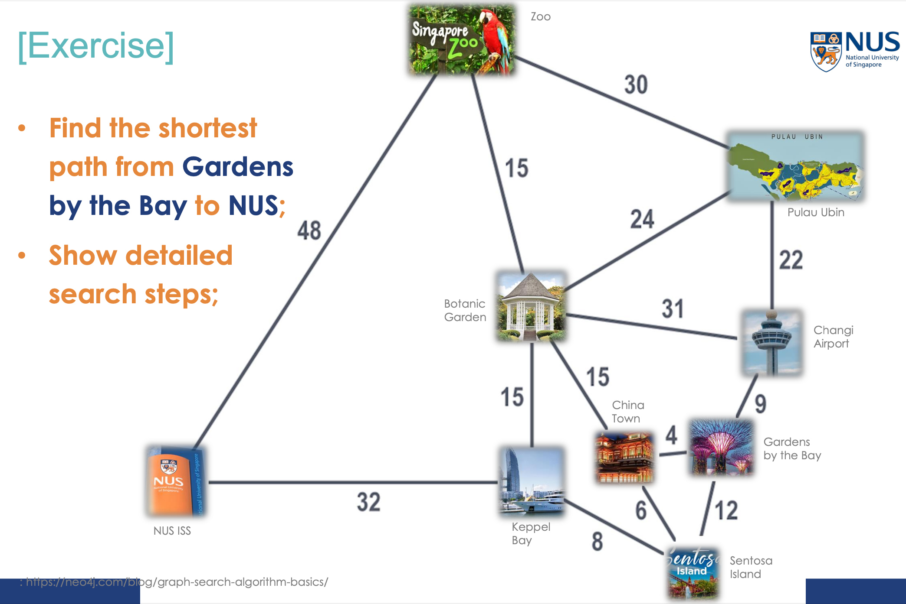

This session explored how AI reasoning systems can drive organizational innovation by predicting staffing needs and dynamically redeploying resources in real-time. Participants gained hands-on experience integrating AI techniques, from data mining to evolutionary computation, building intelligent systems for industries like healthcare, education, and logistics.

---

---

Title:

Unveiling the Power of AI Reasoning Systems and the Future of AI
