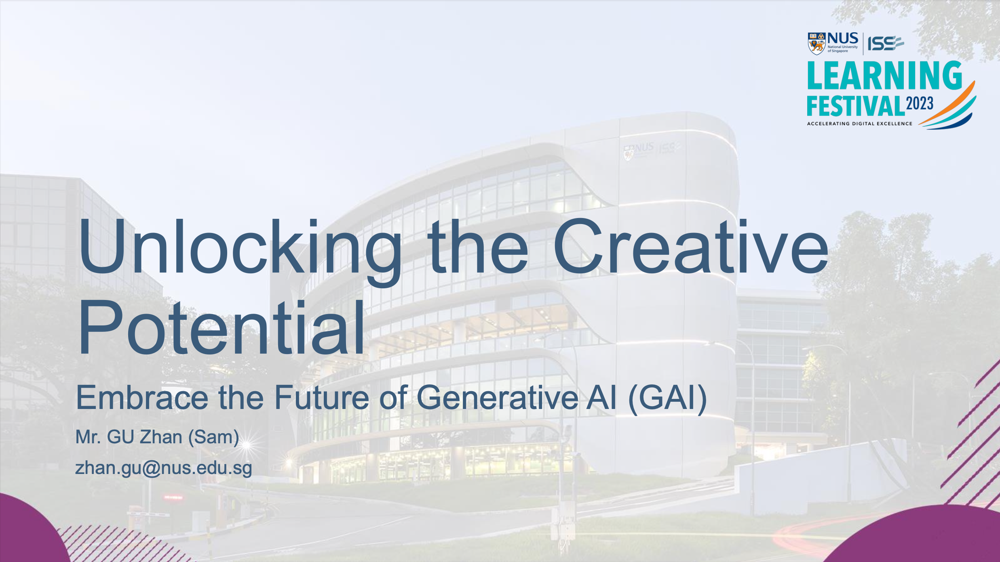
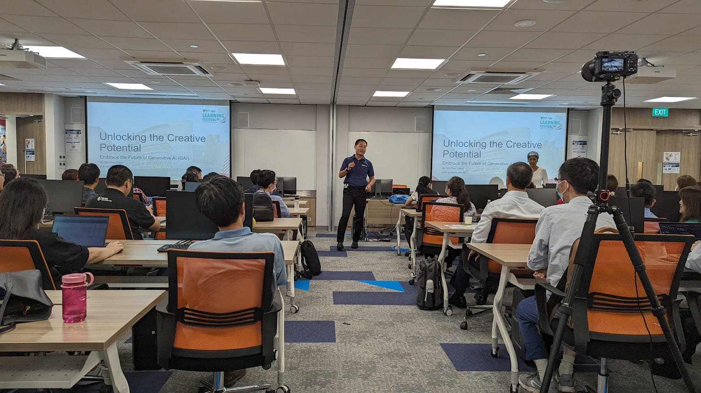
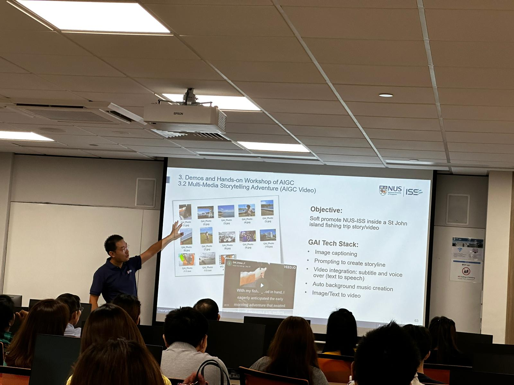
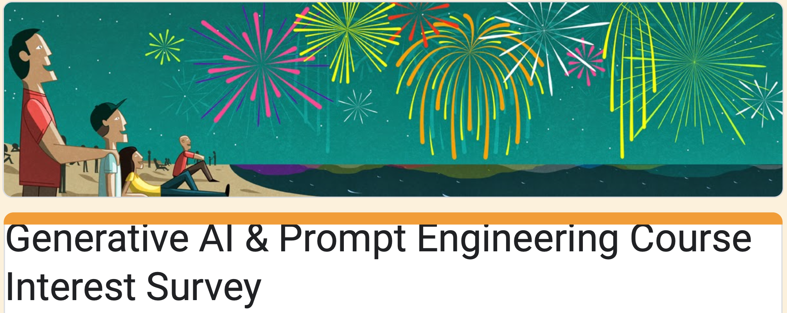
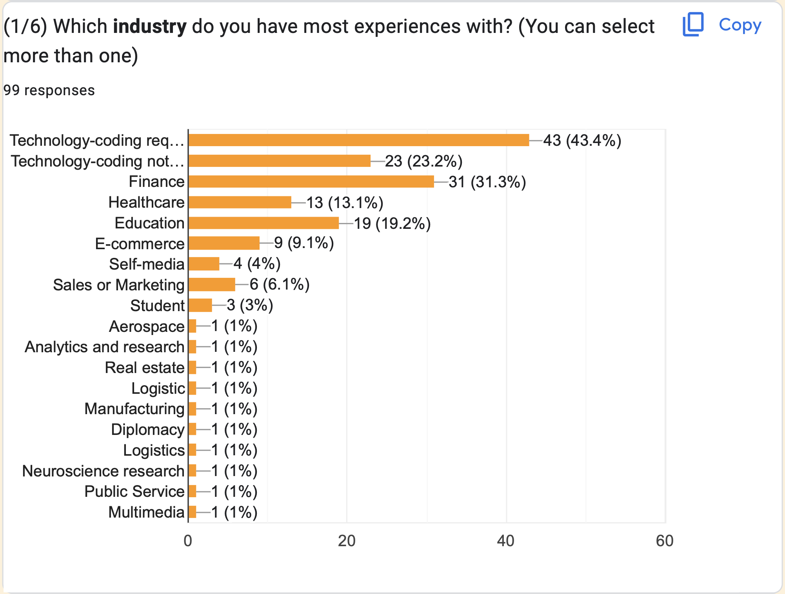
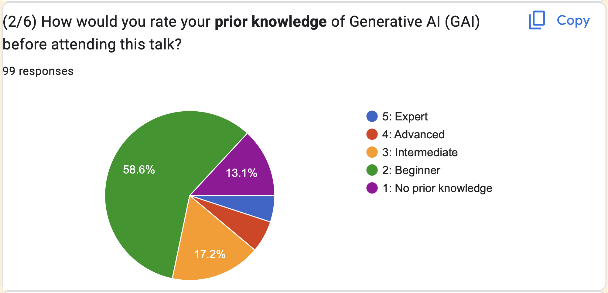
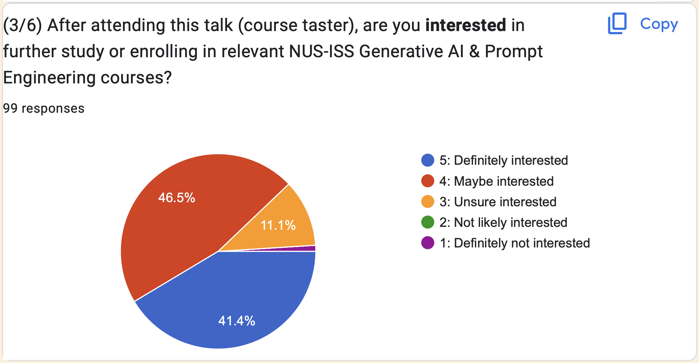
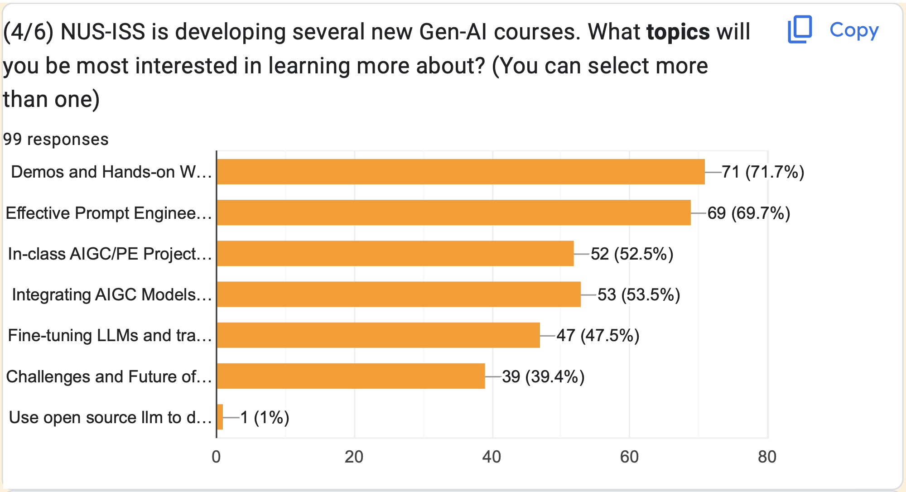
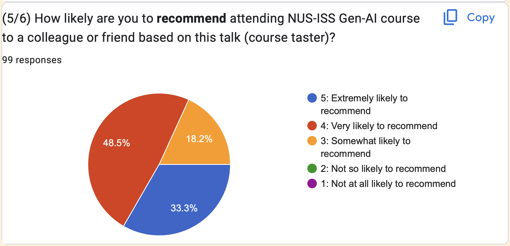

This session captivated a full-house audience, exploring the transformative world of Generative AI (GAI) during NUS-ISS's October 2023 open day. Attendees left inspired and equipped with hands-on skills to craft impactful AI prompts, ready to lead their organizations into an AI-driven future.

---

---

Title:

Unlocking the Creative Potential: Embrace the Future of Generative AI (GAI)

Synopsis:

Prepare to dive headfirst into the exciting world of Generative AI in this enlightening talk. We will unravel its latest advancements and showcase its wide-ranging applications across various domains. You will gain a profound appreciation for the boundless potential of AI, leaving you inspired to wield its power responsibly and ready to lead your organisation into the next era of AI-driven business.

But that's not all; we're taking it a step further with an integrated hands-on session, guided by NUS-ISS lecturers. Get ready to roll up your sleeves and practice designing effective prompts, optimising them, and exploring different prompt styles to unlock valuable responses. This session promises to equip you with practical skills to harness the true potential of Generative AI.

During NUS-ISS open day's learning festival in October 2023, this Generative AI talk attracted the largest audience in NUS-ISS: full house with standing participants.
