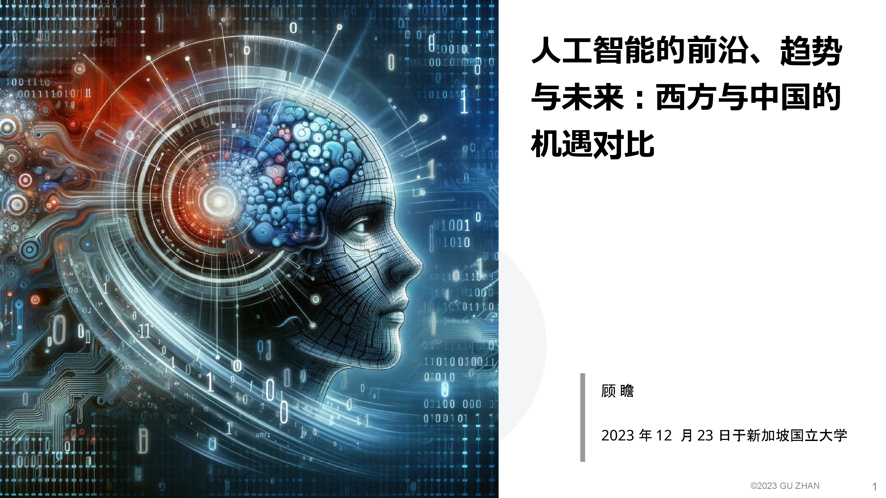
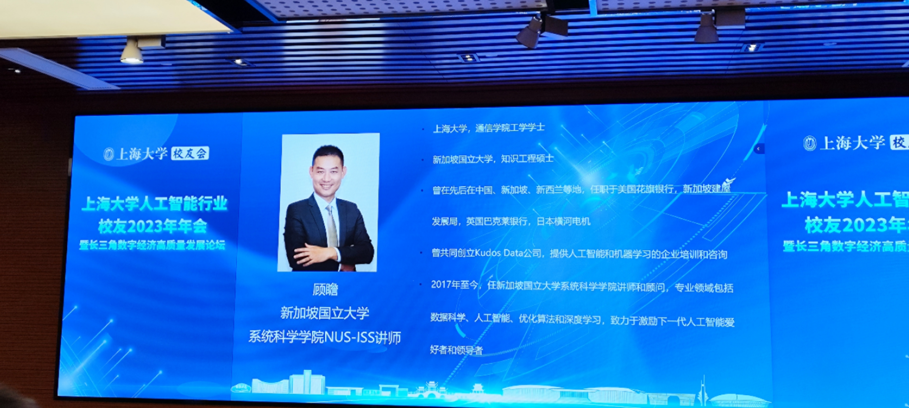
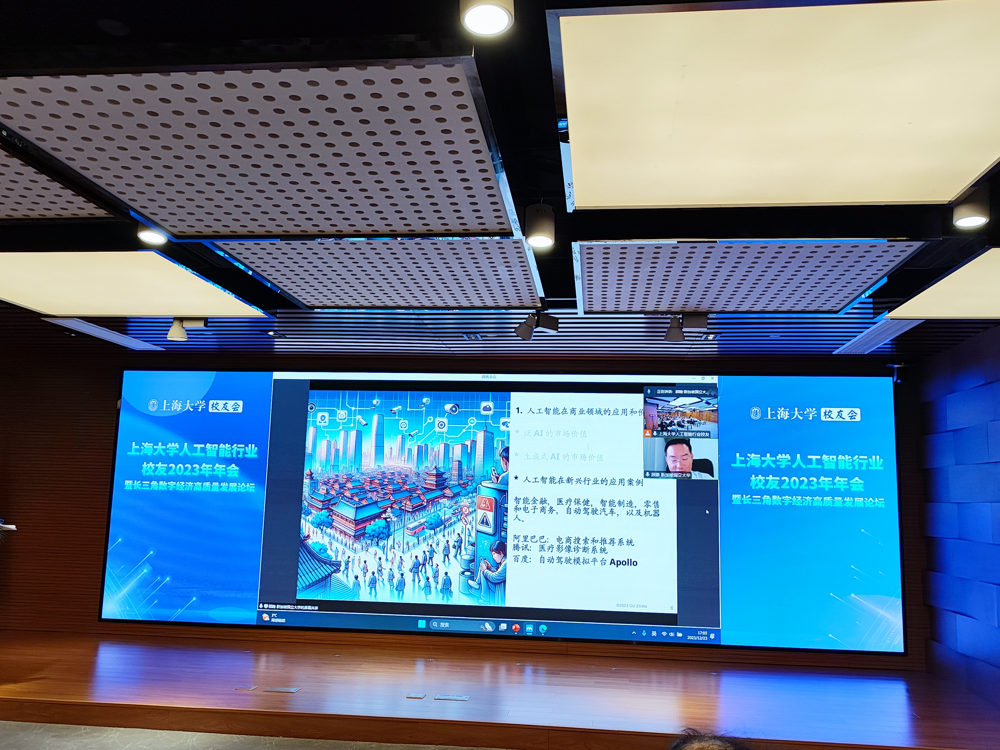
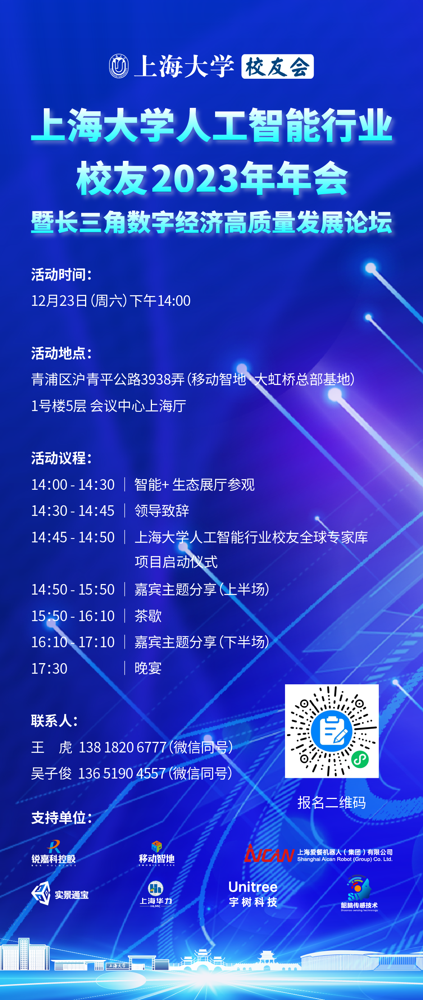

This session delved into the evolving landscape of Artificial Intelligence, comparing opportunities and challenges between the West and China. Attendees gained insights into the future of AI, frontier technologies, and the global business environment shaping AI’s growth and intellectual property strategies.

---

---

Title:
Frontiers, Trends, and Future of Artificial Intelligence: A Comparison of Opportunities between the West and China

Synopsis:

Artificial Intelligence (AI) is not only a scientific field but a revolution that endows computer systems with human-like intelligent behavior, including learning, reasoning, self-correction, and perception.

Agenda:

1. Applications and Value of AI in Business

The market value of General AI

The market value of Generative AI

Case studies of AI applications in emerging industries

2. Frontier Technologies and Development Trends in AI

Deep Learning and Machine Learning

Generative Artificial Intelligence (AIGC / GAI)

3. Comparison, Opportunities, and Challenges in AI between the West and China

Policy and government support

Research and development

Business environment and innovation

Data acquisition and application

International collaboration and competition

Opportunities and challenges

4. Future Outlook and Conclusion

Future developments in artificial intelligence

Trends in cooperation and competition between the West and China

5. Intellectual Property in Generative AI

Representative cases from China and the United States

Strategies and summary for intellectual property protection

I would like to thank the Shanghai University AI Alumni Association for the invitation; it is a great honor to return to my alma mater to present my talk, "Frontiers, Trends, and Future of Artificial Intelligence: A Comparison of Opportunities between the West and China." As an alumnus who graduated from the School of Communication in 2005, I am thrilled to engage in discussions with leaders, industry experts, and fellow alumni.

---

人工智能的前沿、趋势与未来：西方与中国的机遇对比

人工智能（AI）。人工智能不仅是一门科学，更是一种革命。它赋予计算机系统以类似人类的智能行为，包括学习、推理、自我修正、感知等功能。

1. 人工智能在商业领域的应用和价值 

* 泛AI的市场价值

* 生成式AI的市场价值

* 人工智能在新兴行业的应用案例

2. 人工智能的前沿技术与发展趋势 

* 深度学习和机器学习

* 生成式人工智能（AIGC / GAI）

3. 中西方在人工智能领域的的对比、机遇与挑战 

* 政策和政府支持

* 研究和开发

* 商业环境和创新

* 数据获取和应用

* 国际合作和竞争

* 机遇和挑战

4. 未来展望与结论 

* 人工智能未来的发展

* 中西方合作与竞争的趋势

5. 生成式人工智能的知识产权 

* 中国和美国的代表性案例

* 知识产权保护的策略与总结

感谢上海大学人工智能校友会的邀请，我非常荣幸能回到母校分享我的讲座《人工智能的前沿、趋势与未来：西方与中国的机遇对比》。作为2005年毕业于通信学院的校友，我对于能在这里与各位领导、行业专家和校友交流感到非常激动。
