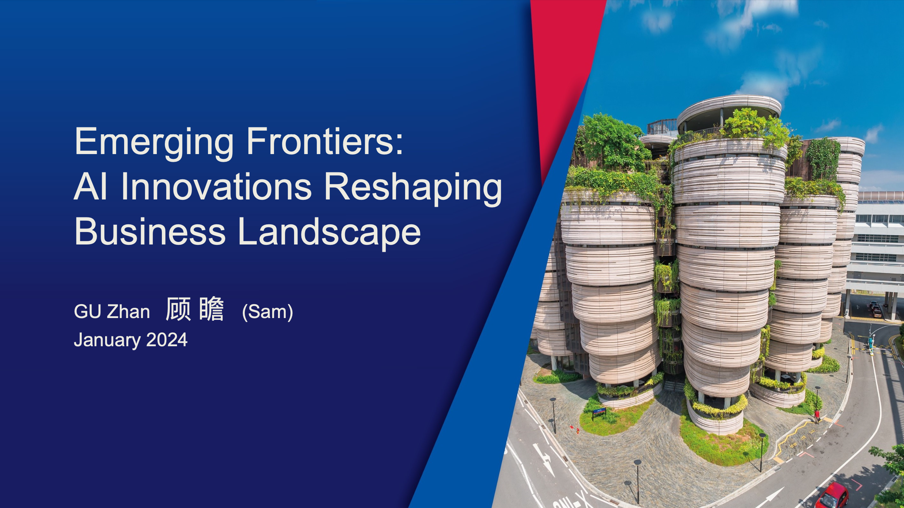

This session explored cutting-edge AI innovations that are transforming the business landscape, highlighting the potential of generative AI to drive new growth opportunities. Attendees gained insights into prompt engineering, large multimodal models, and the economic impact of AI advancements on modern enterprises.

---

---

Title:

Emerging Frontiers: AI Innovations Reshaping Business Landscape

GU Zhan 顾 瞻 (Sam) January 2024

Agenda:

● Era of Generative AI (GAI)

● Prompt Engineering – Economic Perspective 

● Large Multimodal Models (LMM)

● Business Implications

