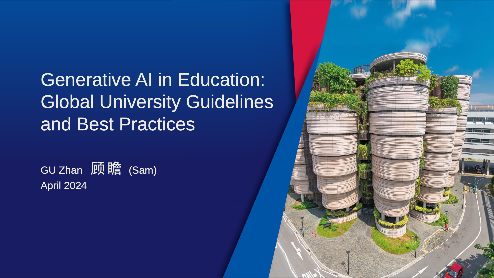

This session explored how global universities are shaping best practices for Generative AI in education, offering insights into policies from leading institutions. Attendees gained practical tools to prevent AI-related plagiarism and heard a firsthand account of the speaker’s journey in integrating GenAI into educational frameworks.

---

---

Title:

Generative AI in Education: Global University Guidelines and Best Practices

GU Zhan 顾 瞻 (Sam) April 2024

Agenda:

● Global Outlook of GenAI for Education (5 minutes)

● GenAI Guidelines and Policies from Universities and Authoritative Bodies (25 minutes)

● Key Comparisons of GenAI Guidelines and Policies (5 minutes)

● Preventing GenAI Plagiarism: Guidance and Tools for Teachers (10 minutes)

● My Own GenAI Journey for Preparing This Talk