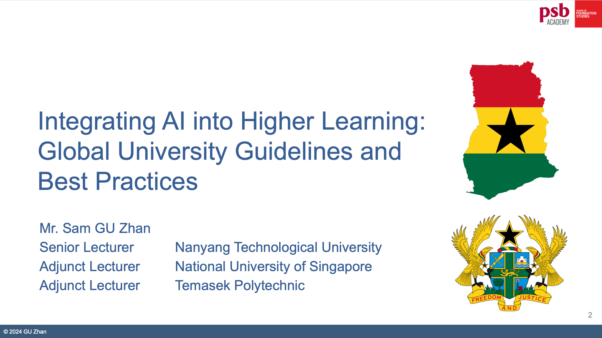

This session provided Ghanaian educational delegates with valuable insights into AI's transformative role in higher education, highlighting global guidelines and best practices from top universities. Delegates explored strategies for ethical, equitable, and impactful AI adoption to foster inclusive academic growth.

---

---

Title:

Integrating AI into Higher Learning: Global University Guidelines and Best Practices

In this talk, we will explore the transformative potential of artificial intelligence (AI) in higher education and discuss global guidelines and best practices for integrating AI technologies into university settings. Drawing on examples from leading institutions around the world, we will explore the opportunities and challenges of adopting AI in the classroom and beyond. We will identify key considerations for implementing AI initiatives in diverse academic contexts and highlight strategies for ensuring ethical, equitable, and inclusive AI practices. Whether you are a university administrator, faculty member, or education policymaker, this talk will provide valuable insights into harnessing the power of AI to shape the future of higher education. 

Agenda

●Global Outlook of AI for Higher Learning

●AI Guidelines and Policies from Universities and Authoritative Bodies 

●Key Comparisons of AI Guidelines and Policies

●Preventing GenAI Plagiarism: Guidance and Tools

●Opportunities for Ghana Higher Learning
