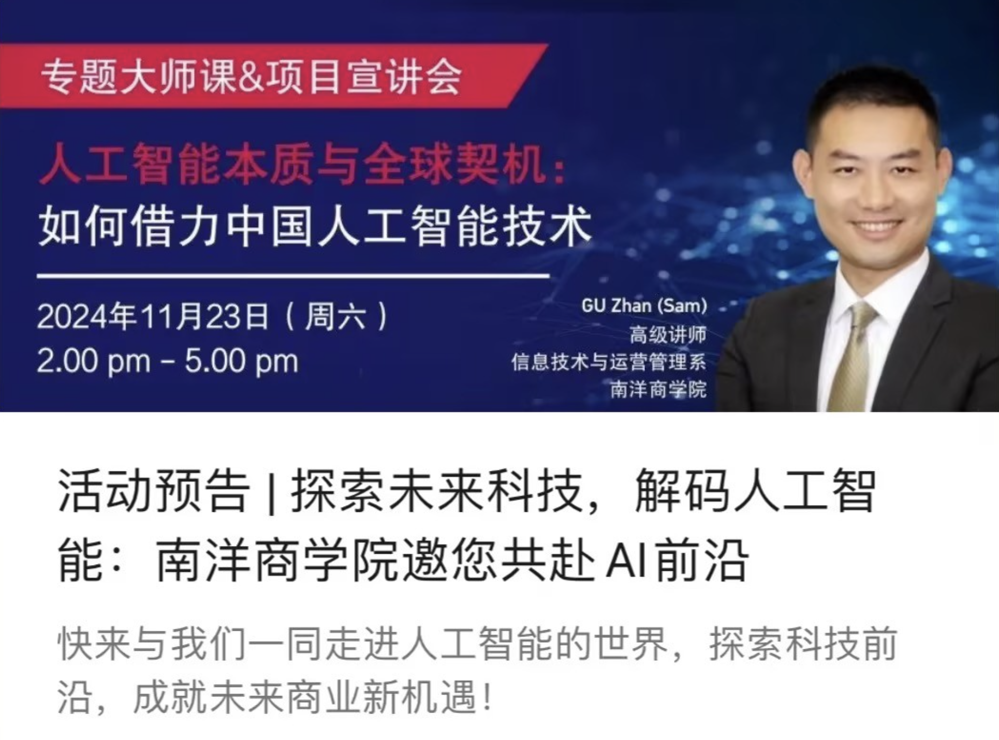

This session delved into China’s advancements in AI, showcasing innovations in facial recognition, computer vision, and robotics that emulate human cognitive abilities. Attendees discovered global opportunities these technologies present, supported by insights from leading AI firms and the 2024 Technology Trends Outlook report.

---

---

Title:

AI Essences and Global Opportunities: Harnessing Chinese AI Technologies

Synopsis:

This session explores the similarities between human and machine intelligence, focusing on how AI emulates and extends human cognitive abilities like learning and reasoning. We’ll examine China’s advancements in AI, particularly in facial recognition, computer vision, and robotics, and explore the global opportunities these innovations present. Featuring case studies from top AI and tech firms, along with statistics from a global top consulting firm’s 2024 Technology Trends Outlook report, the session will provide insights to leverage AI for business innovation and global growth.

Join us to connect with like-minded, enthusiastic professionals and explore how AI can transform your business and the global landscape.

