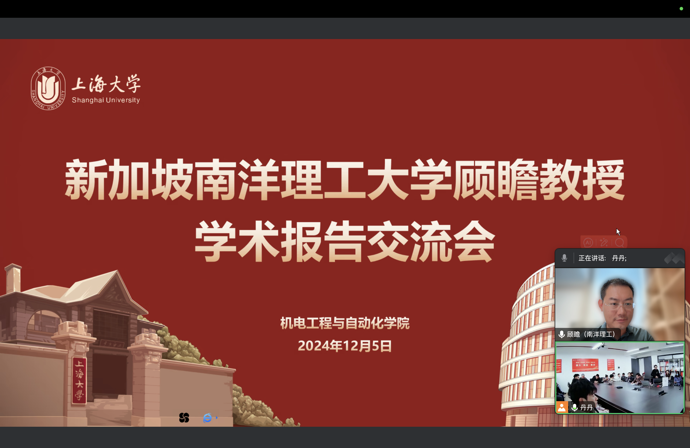
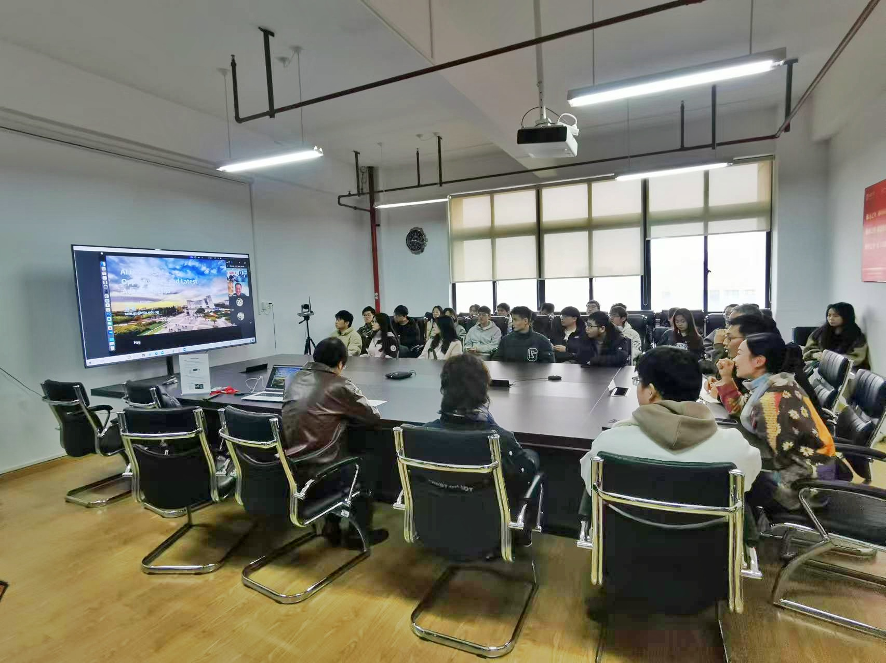

This session explores AI's transformative impact on industries, emphasizing advancements in intelligent manufacturing, robotics, and automated systems. Insights from global trends and China's achievements will guide discussions on leveraging AI for innovation and integration across research, education, and industry.

---

---

Title:

AI Essences, Opportunities and Latest Advancements

Synopsis:

This session will delve into how artificial intelligence (AI) drives transformations across industries, with a particular focus on applications in mechanical automation. Starting with the parallels between biological and machine intelligence, we will explore how AI mimics and enhances cognitive abilities such as learning and reasoning.

The talk will highlight AI's groundbreaking applications in intelligent manufacturing, robotic control, and automated systems, while analyzing China's leading achievements in AI and robotics.

Additionally, leveraging insights from the 2024 Technology Trends Outlook by a global consulting firm, we will offer profound insights into exploring industry opportunities and innovation. Join us to connect with like-minded professionals and discuss how to integrate AI into research, education, and industrial practices to accelerate technological and application breakthroughs.
