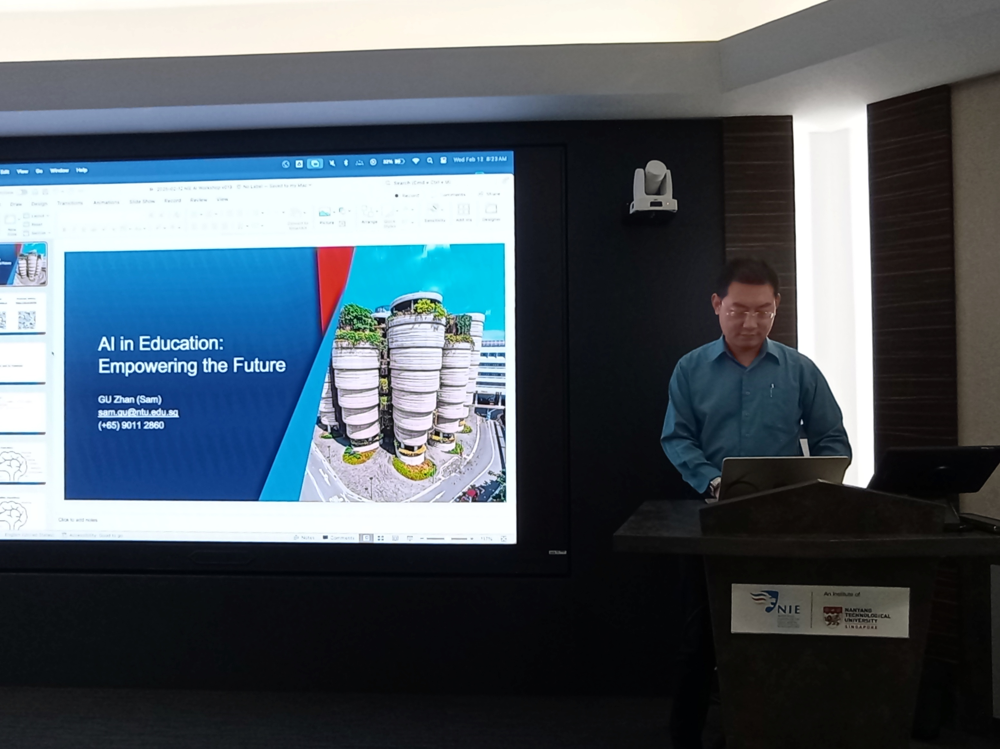

This interactive half-day workshop is designed to introduce faculty and researchers in education, special education, psychology, child development, and other related fields to the transformative potential of Artificial Intelligence (AI). Participants will explore foundational AI concepts, discuss real-world applications, identify key challenges in their domains, and brainstorm innovative AI-driven solutions. The session aims to equip participants with actionable strategies, practical tools, and frameworks to integrate AI into their academic and research practices effectively.

---

---

Title:

AI in Education: Empowering the Future

Synopsis:

This interactive half-day workshop is designed to introduce faculty and researchers in education, special education, psychology, child development, and other related fields to the transformative potential of Artificial Intelligence (AI). Participants will explore foundational AI concepts, discuss real-world applications, identify key challenges in their domains, and brainstorm innovative AI-driven solutions. The session aims to equip participants with actionable strategies, practical tools, and frameworks to integrate AI into their academic and research practices effectively.

Workshop Objectives:

* Understand AI concepts, capabilities, and applications and uses cases in education, teaching and learning, research and student development.

* Identify key challenges within these fields and align them with AI solutions through collaborative activities and discussions.

* *Explore practical tools, frameworks, and strategies to implement AI effectively in academic and research environments.

Takeaways:

Participants will leave with a deeper understanding of AI’s potential, practical tools tailored to their disciplines, and strategies for addressing current challenges through innovative AI solutions. This workshop aims to inspire collaboration and set the foundation for integrating AI into future educational and research initiatives.
